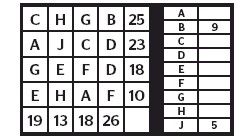

[](https://app.codacy.com/manual/musyoki.tralah/Solvit?utm_source=github.com&utm_medium=referral&utm_content=TralahM/Solvit&utm_campaign=Badge_Grade_Dashboard)
[](https://travis-ci.com/TralahM/Solvit)
[](https://Solvit.readthedocs.io/en/latest/?badge=latest)
[](https://opensource.org/licenses/MIT)
[](https://github.com/TralahTek)
[](http://dwyl.io/TralahM/Solvit)
[](https://github.com/TralahM/Solvit/pull/)
[](https://github.com/TralahM/Solvit/pull/)
[](https://github.com/TralahM)

# Solvit.

Solvit Alphametic Puzzle Solver



[](https://github.com/TralahTek)
[](https://github.com/TralahM)
[](https://github.com/TralahM)

# Documentation

[](https://github.com/TralahM/Solvit)


```python

#!/usr/bin/env python
from argparse import ArgumentParser
from sympy import Symbol
from sympy import solve_linear_system
from sympy import Matrix

# from pprint import pprint
from random import sample


def ps(s, n, ex=[]):
    xs = list(range(1, 10))
    [xs.remove(x) for x in ex]

    a = sample(xs, n)
    while sum(a) != s:
        a = sample(xs, n)
    return list(sorted(a)), sum(a)


def main():
    """Main Entrypoint."""
    ps = ArgumentParser()
    ps.add_argument(
        "input_file",
        action="store",
        help="""Solvit Input File.

        The file should have the following format:

        A file of 8 equations as specified in the solvit puzzle separated by
        commas and the last entry in the line the corresponding sum.

        a,b,c,d,20
        e,f,g,h,23
        j,e,f,h,18,
        b,a,d,e,20
        a,e,c,d,21
        e,f,g,j,23
        a,e,f,j,18,
        j,a,d,e,20

    """,
    )
    args = ps.parse_args()
    system = read_and_parse_input_file(args.input_file)
    solution, (a, b, c, d, e, f, g, h, j) = solve_puzzle(system)
    # print solution
    print("\n\n")
    print("Solution:")
    for k in solution.keys():
        print("{}: {}".format(k, solution[k]))
    return solution, (a, b, c, d, e, f, g, h, j)


def solve_puzzle(M):
    """Solve the puzzle given the linear system described Matrix M."""
    # create symbols
    a, b, c, d, e, f, g, h, j = [Symbol(x, positive=True) for x in "abcdefghj"]
    # solve the system
    sol = solve_linear_system(M, a, b, c, d, e, f, g, h, j)
    return sol, (a, b, c, d, e, f, g, h, j)


def read_and_parse_input_file(input_file):
    """Read and parse input file.

    Return a 9x10 Matrix of the equations in the file together with an
    additional equation including all letters summing to 45.

    """
    rows = []
    with open(input_file, "r") as rf:
        for line in rf.readlines():
            line = line.replace("\n", "")
            rows.append(line.split(","))
    # transform input rows to 1 or 0
    mrows = []
    dhs = []
    for r in rows:
        cols = []
        dh = dict(zip("abcdefghj", [0 for _ in range(9)]))
        for c in r:
            if c.lower() in dh:
                dh[c.lower()] += 1
        dh["sum"] = int(r[-1])
        cols = [dh[k] for k in sorted(dh.keys())]
        mrows.append(cols)
        dhs.append(dh)
    mrows.append([1 for _ in range(9)] + [45])
    # print puzzle as would appear in solvit
    print("Puzzle:")
    for d in dhs:
        for k, v in d.items():
            if k != "sum":
                if v != 0:
                    for i in range(v):
                        print("{} +".format(k.upper()), end=" ")
            else:
                print("= {}".format(d[k]))

    M = Matrix(mrows)
    # pprint(M)
    return M


if __name__ == "__main__":
    solution, (a, b, c, d, e, f, g, h, j) = main()

```

# How to Install
```bash
# In terminal do:
$ pip install solvit
```

## Building from Source for Developers

```console
$ git clone https://github.com/TralahM/Solvit.git
$ cd Solvit
$ pip install -e .
```


## Input from a csv file of the Puzzle

| x1 | x2 | x3 | x4 | sum |
|----|----|----|----|-----|
| C  | H  | G  | B  | 25  |
| A  | J  | C  | D  | 23  |
| G  | E  | F  | D  | 18  |
| E  | H  | A  | F  | 10  |
| C  | A  | G  | E  | 19  |
| H  | J  | E  | H  | 13  |
| G  | C  | F  | A  | 18  |
| B  | D  | D  | F  | 26  |

# Contributing
[See the Contributing File](CONTRIBUTING.rst)


[See the Pull Request File](PULL_REQUEST_TEMPLATE.md)


# Support

# LICENCE

[Read the license here](LICENSE)


# Self-Promotion

[](https://twitter.com/TralahM)
[](https://github.com/TralahM)
[](https://kaggle.com/TralahM)
[](https://linkedin.com/in/TralahM)


[](https://tralahm.tralahtek.com)


[](https://tralahtek.com)


